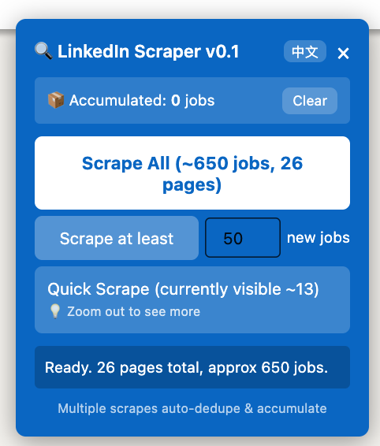

# LinkedIn Job Scraper

**English** | [中文](README_zh.md)

A simple userscript to scrape job listings from LinkedIn job pages.



## Supported Pages

- Recommended jobs (`/jobs/collections/recommended/`)
- Saved jobs (`/jobs/collections/saved/`)
- Search results (`/jobs/search/`)
- Jobs home (`/jobs/`)

## Features

- Scrape jobs from LinkedIn recommended jobs page
- Auto-deduplication using company + title + location
- Accumulation mode - multiple scrapes combine automatically
- Priority sorting: Top Applicant > Connections > Recent > Easy Apply
- Bilingual UI (English / Chinese)

## Installation

### Step 1: Install Tampermonkey

Install the Tampermonkey browser extension:

| Browser | Link |
|---------|------|
| Chrome | [Chrome Web Store](https://chrome.google.com/webstore/detail/tampermonkey/dhdgffkkebhmkfjojejmpbldmpobfkfo) |
| Firefox | [Firefox Add-ons](https://addons.mozilla.org/en-US/firefox/addon/tampermonkey/) |
| Edge | [Edge Add-ons](https://microsoftedge.microsoft.com/addons/detail/tampermonkey/iikmkjmpaadaobahmlepeloendndfphd) |
| Safari | [Mac App Store](https://apps.apple.com/app/tampermonkey/id1482490089) |

### Step 2: Install the Script

**Option A: From URL**

Click: [Install Script](https://raw.githubusercontent.com/qinip/linkedin-job-scraper/main/linkedin-job-scraper.user.js)

**Option B: From local file**

1. Download `linkedin-job-scraper.user.js`
2. Open Tampermonkey Dashboard → Utilities → Import from file
3. Select the downloaded file

## Usage

1. Go to any LinkedIn Jobs page (Recommended, Search, Saved, etc.)

2. A blue panel will appear on the right side

3. Click a scrape button:
   - **Scrape All** - Scrape all pages
   - **Scrape at least N** - Scrape until N new jobs found
   - **Quick Scrape** - Scrape currently visible jobs only

4. Results are copied to clipboard and can be downloaded as JSON

## Output Format

```json
{
  "id": "4331586853",
  "title": "Staff Machine Learning Engineer",
  "company": "Example Corp",
  "location": "San Francisco, CA (Hybrid)",
  "salary": "$175K/yr - $225K/yr",
  "isTopApplicant": true,
  "hasConnections": false,
  "hasEasyApply": true,
  "postedAgo": "3 days ago",
  "daysAgo": 3,
  "postedDate": "2026-01-22",
  "link": "https://www.linkedin.com/jobs/view/4331586853/"
}
```

## Notes

- Accumulated data is stored in browser session (clears when tab closes)
- Download location is controlled by your browser settings
- Promoted jobs may not have posting dates

## License

MIT License
