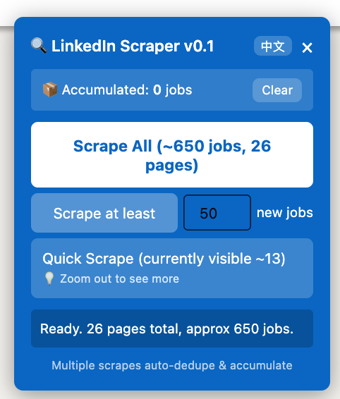

# LinkedIn 职位抓取器

[English](README.md) | **中文**

一个 Tampermonkey 用户脚本，从 LinkedIn 职位页面抓取职位信息，支持自动去重、累积模式和职位 ID 补全。



## 支持的页面

- 推荐职位 (`/jobs/collections/recommended/`)
- 已保存职位 (`/jobs/collections/saved/`)
- 搜索结果 (`/jobs/search/`)
- 职位主页 (`/jobs/`)

## 功能

- 从任意 LinkedIn 职位页面抓取职位
- **点击式职位 ID 补全** - 自动点击每张职位卡片获取 LinkedIn 职位 ID，链接率达到约 97% (v0.3.2)
- 自动去重（基于公司 + 职位名 + 地点）
- 累积模式 - 多次抓取自动合并
- 优先排序：Top Applicant > 有人脉 > 最新发布 > Easy Apply
- SPA 导航支持 - 页面切换时面板不消失
- 双语界面（英文 / 中文）

## 安装

### 第一步：安装 Tampermonkey

安装 Tampermonkey 浏览器扩展：

| 浏览器 | 链接 |
|--------|------|
| Chrome | [Chrome 应用商店](https://chrome.google.com/webstore/detail/tampermonkey/dhdgffkkebhmkfjojejmpbldmpobfkfo) |
| Firefox | [Firefox 附加组件](https://addons.mozilla.org/en-US/firefox/addon/tampermonkey/) |
| Edge | [Edge 扩展商店](https://microsoftedge.microsoft.com/addons/detail/tampermonkey/iikmkjmpaadaobahmlepeloendndfphd) |
| Safari | [Mac App Store](https://apps.apple.com/app/tampermonkey/id1482490089) |

> **Safari 用户：** 安装 Tampermonkey 后，需要在 Safari 设置中开启 **Allow User Scripts**。前往 Safari > 设置 > 扩展 > Tampermonkey，打开 "Allow User Scripts" 开关。详见 [Tampermonkey Safari 常见问题](https://www.tampermonkey.net/faq.php#Q209)。

### 第二步：安装脚本

**方法 A：从链接安装**

点击：[安装脚本](https://raw.githubusercontent.com/qinip/linkedin-job-scraper/main/linkedin-job-scraper.user.js)

**方法 B：从本地文件安装**

1. 下载 `linkedin-job-scraper.user.js` 文件
2. 打开 Tampermonkey 控制台 > 实用工具 > 从文件导入
3. 选择下载的文件

## 使用方法

1. 打开任意 LinkedIn 职位页面（推荐、搜索、已保存等）

2. 右侧会出现蓝色面板

3. 点击抓取按钮：
   - **Quick Scrape** - 快速抓取当前已加载的职位（不滚动/翻页）
   - **Scrape at least N** - 滚动/翻页直到抓取到 N 个新职位

4. 结果会复制到剪贴板，也可下载为 JSON 文件

## 输出格式

```json
{
  "id": "4363843832",
  "title": "Machine Learning Engineer - AI Decision Intelligence Platform",
  "company": "Andiamo",
  "location": "Washington, DC (Hybrid)",
  "salary": "",
  "isTopApplicant": true,
  "hasEasyApply": true,
  "hasConnections": false,
  "postedAgo": "",
  "daysAgo": -1,
  "postedDate": "",
  "insight": "You'd be a top applicant",
  "footer": "Viewed, Promoted, Easy Apply",
  "link": "https://www.linkedin.com/jobs/view/4363843832/",
  "extractedAt": "2026-03-18T22:36:53.439Z",
  "_source": "linkedin-classic-ui",
  "dedupeKey": "andiamo|||machine learning engineer...|||washington, dc"
}
```

## 更新日志

### v0.3.2 (2026-03-18)
- 点击式职位 ID 补全（链接率从 43% 提升到 97%）
- SPA 导航修复 - LinkedIn 页面切换时面板不再消失
- 提升 LinkedIn 新 UI 下的稳定性

### v0.1.5 (2026-03-18)
- 改进新 UI 下的去重和分页抓取

### v0.1.1
- 改进新 UI 解析，简化按钮布局

### v0.1 (2026-01-25)
- 首次发布

## 注意事项

- 累积数据存储在浏览器会话中（关闭标签页后清空）
- 下载位置由浏览器设置决定
- 推广职位可能没有发布日期
- 脚本会点击职位卡片以提取 ID，视觉上几乎无感但可能短暂高亮卡片

## 许可证

MIT License
